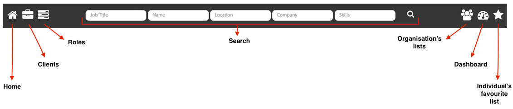
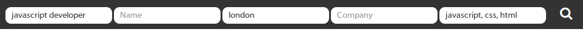
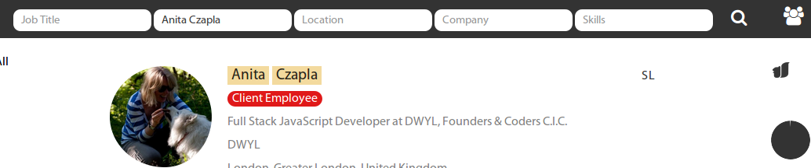
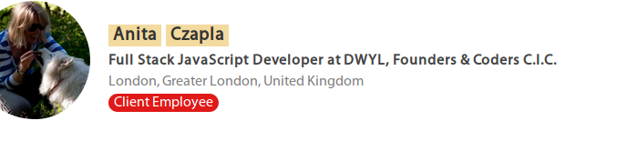
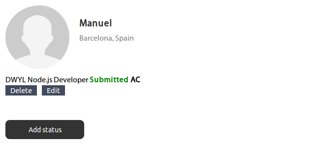
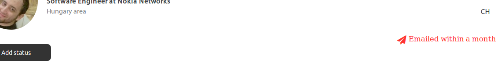
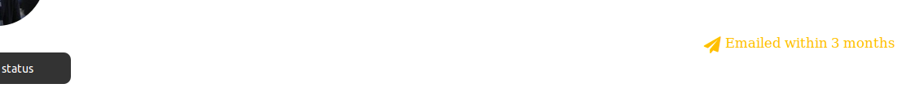
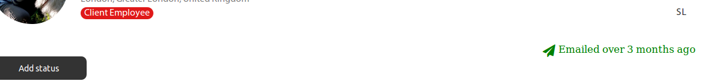
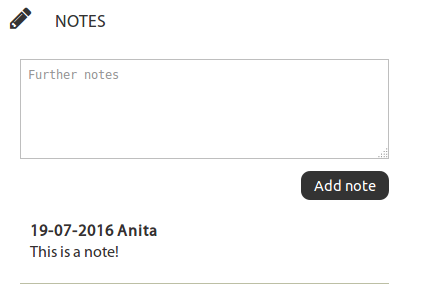
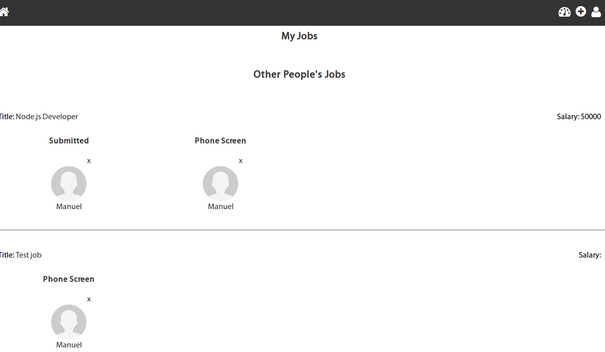

# GM Contact Management App

[](https://travis-ci.org/FAC-GM/app)
[](https://codeclimate.com/github/FAC-GM/app)
[](https://david-dm.org/FAC-GM/app)
[](https://codecov.io/github/FAC-GM/app?branch=master)

## What?

This desktop application which allows specific members of a team to search through
contacts stored in an ElasticSearch database. Further functionality is [described below](#functionality).

## How?

#### The following technologies are used:

* HTML5, CSS3, Javascript
* [Nodejs](https://nodejs.org/en/)
* [Hapijs](http://hapijs.com/)
  * Main packages: [env2](https://github.com/dwyl/env2), Handlebars, Inert, Vision
  * Testing: Lab, Code
* Databases:
  * [ElasticSearch](https://www.elastic.co/)
  * [Redis](http://redis.io/)

#### Build tools
+ [Travis CI](http://travis-ci.org) runs on every pull request
+ [codecov](https://codecov.io/) runs test coverage on every pull request

More technical information on the app can be found in the [`technical-docs` folder](./technical-docs), the guide to which is [`general.md`](./technical-docs/general.md).

## Running the App *Locally*

Clone the Git repository from GitHub:

```sh
git clone git@github.com:FAC-GM/app.git && cd app
```

### ElasticSearch (*our primary database*)

You will need to have ***ElasticSearch*** running on your local
machine for this to work.  
If you are on Linux/Mac and ***don't want*** to install the Java Runtime
*because* [***Java*** *is* ***insecure***](https://goo.gl/cqEhN4)  
we *recommend* you use [***Vagrant***](https://github.com/dwyl/learn-vagrant)
to run ElasticSearch in a Virtual Machine.  

We have included a `Vagrantfile` with the *bare minimum* you need to
get ElasticSearch up and running. Provided you already have
Vagrant and VirtualBox installed on your machine, you can boot the ES VM
with:

```sh
vagrant up
```


### `.env` file

You will also need to have a `.env` file in the root of your project
with the following environment variables:

```sh
SEARCHBOX_URL #This is changed depending on whether you're running the app with the live database or a local one
PORT
ES_INDEX
ES_TYPE
ES_TYPE_ANALYTICS
RESULTS_PER_PAGE
RESULTS_PER_PAGE_CSV
ES_TYPE_CATEGORIES
JWT_SECRET
JWT_SECRET_CLIENT
BASE_URL
GOOGLE_CLIENT_ID
GOOGLE_CLIENT_SECRET
ES_INDEX_DELETED
ES_TYPE_TOAD=toad
ES_TYPE_COUNTRIES
ES_TYPE_SECTORS
ES_TYPE_CV
CV_ACCESS_TOKEN
CV_ID_TOKEN
CV_REFRESH_TOKEN
CV_EXPIRY_DATE
CV_TOKEN_TYPE
FOLDER_ID
SEARCHBOX_URL_FIXTURES
ES_INDEX_FIXTURES
ES_TYPE_CURRENT_USERS
ES_TYPE_GM_USERS
ES_TYPE_GM_CLIENTS
ES_TYPE_GM_JOBS
ES_TYPE_STATUS
ES_TYPE_GM_CLIENT_USERS
ES_TYPE_CSV_LIST

```

All of the variable values are missing from the example above, but these are available from the dev team.

The MAP_ID_USER environment variable is used to map the id from the user to their first name. We are using the ids to identify users, however, the application shouldn't display the id of the user but the first name and this is where MAP_ID_USER is useful. see the discussion on Github for more details: [issue 215](https://github.com/FAC-GM/app/issues/215) and [issue 238](https://github.com/FAC-GM/app/issues/238)

### Install *node.js* dependencies

```sh
npm install
```

### Run the Unit Tests

```sh
npm test
```

### Boot the App

```sh
npm start
```

Now visit http://localhost:8000 in your browser to view the site.


## Functionality

+ [Login via Google](https://github.com/dwyl/hapi-auth-github), with access restricted to specific team members


+ This access is restricted via a users page which allows admin users the right to create or remove users as well as assign admin rights

### Homepage/search page navigation
Logging in takes the user to a page that displays a list of the candidates in the application, with the *most recent candidates* that have been added to the application *at the top*. 

+ The navigation bar across the top allows for quick access to the most used functionality, including:
  + `Home`, a shortcut across all pages ensuring the users can get to the home page quickly
  + `Clients`, where users can access the full client list as well as add new clients 
  + `Roles`, where users can access current roles (both active and inactive) and add new roles - these contain a lot of information as [this information will also appear on the website](#linking-to-the-website)
  + `Organisation's lists`, where lists of candidates can be uploaded, downloaded and kept in one location - this was born from a concept of having 'hot lists'
  + `Dashboard`, where a user can see all of their clients, roles and candidates who are in certain stages of role applications
  + `Favourites list`, where as opposed to in the 'organisation's lists', a user can see their own individual favourited candidates



### Searching

+ The navigation bar across the top allows for **targeted searching** of candidates through job, full name, location, company and/or skills
  + A user can search for multiple skills if they separate the each skill with a comma:



+ **Search keywords are highlighted in the search results** to facilitate quick scanning of the information
  + This carries through to the profile pages so that the search terms can be found quickly and easily




+ Searching displays a pie-chart to indicate 'match score' for search results

- For example, a 66% match is shown as below (*one* of the two names searched for *and* the location are a match):


Further details on the agreements around the match score can be found in the backlog here: https://github.com/FAC-GM/app/issues/206 .

### Homepage/search page candidate list
The candidate blocks appearing on this page contain a dense amount of information, allowing the user to make informed decisions at a glance.

+ **Initials of who on the team a candidate is connected to** are displayed within the candidate blocks
 _(in the example below, Nick Waller is connected to 'Adam Foster' (AF) and multiple other teammates)_
  + Clicking on these initials will return all of the candidates connected to the user whose initials have been clicked  


+ If the candidate is the employee of a GM client (as defined in the 'Clients' portion of the app), the following 'Client Employee' indicator is displayed on the candidate block:



+ **If a user has been put forward for a role**, this will be displayed in the candidate blocks as well as the candidate's profile


+ This status can also be seen in the candidate profile page, where it can also be edited or deleted
  + Here, one can see the initials of who has made the latest change to the candidate's status - this also denotes that the users with those initials are the 'owners' of that candidate (this means the candidate will show up on their dashboards)
  + Candidates can have **multiple statuses** (i.e. be in various stages of *various* roles) and therefore also have **multiple owners**


### Sending emails through the application
Emails can be sent either to individuals or to multiple candidates by clicking on relevant checkboxes next to the candidate blocks in the home/search pages
  - Emails can also be sent to all 'emailable' candidates *on the current page* by using the 'Select all' checkbox at the top
  - Note emails can also be sent from the candidate's profile page
  
+ Within the home/search page, email indicators have been added to facilitate a quick at-a-glance understanding of when the candidate was last emailed by *any* user of the application:
  + if an email has been sent within a month, a red 'sent icon' is displayed - in the individual's profile this will appear with the text: `Emailed within a month`
    
  + if an email has been sent within 3 months time, an amber 'sent icon' is displayed- in the individual's profile this will appear with the text: `Emailed in less than 3 months`
  
  + if email has been sent more than 3 months ago, a green 'sent icon' is displayed - in the individual's profile this will appear with the text: `Emailed over 3 months ago`
  


+ Each email will carry the personal signature of the user currently logged into the appear
  + The overall formatting of this signature has been hard-coded into the app, but the details are edited through the 'Manage Users' functionality

  

+ Dynamically populating candidates first names and text ```Hi {name}``` when sending an email in a message area

+ Blacklist feature:
  - The email checkbox has been disabled for the following types of candidates to prevent the accidental sending of mass emails to them:
    + Candidates marked as 'client employee'
    + Candidates who have a status and are therefore already part-way through a role application
    
+ *Note: Users without an email address will also have no email checkbox displayed next to their candidate block as it is impossible to email these candidates*

### Favouriting
This functionality is a pre-cursor to the 'Organisation lists' (or 'hot lists') and provides the functionality to *favourite* or *star* candidates, creating a lists that are **specific to that user**
+ 'Favourite' contact profiles by clicking the grey star in the corner of the profile page


+ Quickly visualise who has been favourited in the search results (denoted by a yellow star) and see a full list by clicking on the yellow star in the top right hand corner of the app


### Candidate profiles


+ Adding notes to a profile: status, company and note.




### User dashboard

+ Dashboard for user's candidate's statuses



+ Home button at the top of each page


+ Merging candidates coming from the website

  - following image on the home page indicates the new candidate coming from the website

  

  - jobs applied by the relevant candidate

  
  
### Linking to the website
The website is maintained by a separate agency but there is a two way link to the website (which exchanges information only - no changes were made by the development team to the website), the details of which can be found in the issues labelled `BH`: https://github.com/FAC-GM/app/labels/BH
+ **Outgoing:** Roles added to the application will appear as new roles on the website (usually with no more than an hour's delay)
  + This is done by delivering information to an endpoint (location) which the website looks for at regular intervals
+ **Incoming:** Applicants to specific roles will appear in the app as having applied to that job (contained in the roles list)
  + If the candidate already exists in the app (as identified by their email address), the job will be added to their profile and their CV linked as well (if they have provided one in their application to the job)
  + If not, a new candidate profile will be created within the app containing their email address and any other key details they provided in their application


## Working with this repo
Our [product backlog is our list of issues](https://github.com/FAC-GM/app/issues).

We use labels to manage these. The most interesting ones are:
+ `feature idea` - added to features that are just in idea form for now rather than _definitely_ required
+ `priority...` - labels starting with 'priority' denote the priority of the task from 1 to 5, with 1 being the highest
+ `T...` - labels starting with 'T' denote time estimates for the task; these are added **by the dev team only**, e.g. `T1d` will require one day to complete
  + `m` = minutes
  + `h` = hours
  + `d` = days
+ `in progress` - denotes which tasks are currently being worked on
+ `help wanted` - used mostly internally by the dev team when outside help is required to move an issue forward
+ `technical` - used **by the dev team** to denote technical tasks

## Google Analytics

Google Analytics is enabled for all pages of the App.
If you want access to the stats, please ask a member of the dev team.
